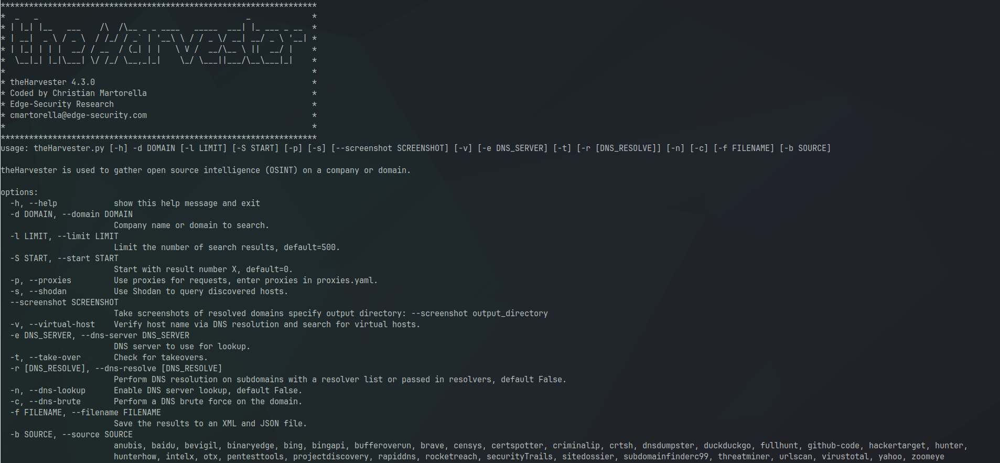
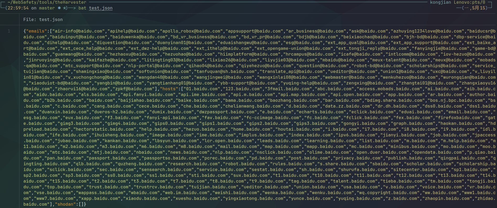

# Arch Linux 安装并使用larmies/theHarvester

> Github：https://github.com/laramies/theHarvester
>
> 依赖:python git pip

## 1.安装：

> `git clone https://github.com/laramies/theHarvester.git`
>
> `cd theHarvester/`
>
> `pip install -r requirements.txt`(网速慢请自行寻找pip镜像站）
>
> `python theHarvester.py -h`

输出如图所示，安装成功

## 2. 命令详解

> -h, --help         显示帮助信息
>
> -d, --domain   要搜索的目标
>
> -l, --limit    输出数量，默认500   
>
> -S, --start     从采集到的信息编号“X”处开始执行采集，默认为0
>
> -p, --proxies   使用代理，调用proxies.yaml
>
> -s, --shodan     使用shodan查询
>
> --screenshot 截图
>
> --screenshot output_directory 截图保存路径
>
> -v, --virtual-host  使用DNS解析 （?）
>
> -e, --dns-server   指定DNS解析服务器
>
> -t, --take-over      在Host found处显示ip
>
> -n, --dns-lookup    启用DNS服务器查找，默认为False状态 (开启`Starting active queries for DNSLookup.`块)
>
> -c, --dns-brute     进行DNS域解析暴力破解
>
> -f, --filename      指定输出文件名，格式支持JSON和XML         
>
> -b SOURCE,--source SOURCE  指定采集信息的源（如百度等)

## 3.使用例

### 3.1 普通调用

我们使用 -d指定搜索的目标，使用-b参数指定搜索引擎baidu,命令如下

 `./theHarvester.py -d baidu.com -b baidu `

> [*] Target: baidu.com
>
> [*] Searching Baidu.
>
> [*] No IPs found.
>
> [*] Emails found: 37
> ----------------------
> air-info@baidu.com
> apihelp@baidu.com
> ...
> zpkf@baidu.com
>
> [*] Hosts found: 124
> ---------------------
> ai.baidu.com
> aib.baidu.com
> ...
> zhidao.baidu.com

### 3.2 子域名接管检查(?)

`./theHarvester.py   -d baidu.com -b baidu -t`

加入 -r 参数后激活子域名接管检查(?)

> [*] Performing subdomain takeover check
>
> [*] Subdomain Takeover checking IS ACTIVE RECON
>
> (调用Fly.io激活主动探查)
>
> `Takeover detected: http://gimg3.baidu.com`
>
> `Type of takeover is: Fly.io`
>
> ``Takeover detected: http://gimg3.baidu.com`
>
>  `Type of takeover is: Fly.io`
>
> ...
>
> `Takeover detected: http://vse.baidu.com`
>
>  `Type of takeover is: Fly.io`

### 3.3 DNS 查询

`./theHarvester.py   -d baidu.com -b baidu -e 8.8.8.8 -n `

新增DNS 查询块（没有回显不知到为什么）

>[*] Starting active queries for DNSLookup.
>
>[*] Hosts found after reverse lookup (in target domain):

### 3.4 DNS爆破 （？）

`./theHarvester.py   -d baidu.com -b baidu -c` 

新增DNS爆破区块

根据自带字典进行DNS爆破

> [*] Starting DNS brute force.
> Starting DNS brute forcing with 4989 words
>
> [*] Hosts found after DNS brute force:
> 100.baidu.com:103.211.221.225
> 123.baidu.com:110.242.68.3, 110.242.68.4
> 2012.baidu.com:157.255.77.215, 153.3.236.50, 157.255.77.214
> 911.baidu.com:10.92.154.58
>
> ...
>
> z.baidu.com:111.206.209.78, 111.206.209.79
> zt.baidu.com:111.206.209.18

发现输出的结果后面跟着i(?)

### 3.5 文件输出

`./theHarvester.py   -d baidu.com -b baidu -f test  `

> `[*] Reporting started.
> [*] XML File saved.`
> `[*] JSON File saved.`

会在当前目录下生成text.json 和 text.xml

用chrome打开xml

bat 打开 test.json 

## 4.常见问题

1.当使用 `./theHarvester.py   -d baidu.com -b all   `	时，会提示缺少API key，可以自行去各大网站查询相应的API key（大多数需要付费），把得到的API key写入到`api-keys.yaml`中的`key:` 后，程序会直接读取API key进行调用引擎

# 个人问题

1.在上文中标记（？）的

